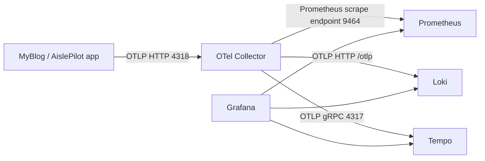

# Local Observability Stack (LGTM + OTel)

This directory provides a production-style local telemetry pipeline for `MyBlog` and `AislePilot`:

- app emits OpenTelemetry traces/metrics/logs
- OpenTelemetry Collector receives, enriches, and routes signals
- Prometheus stores metrics
- Loki stores logs
- Tempo stores traces
- Grafana correlates all signals

## Architecture



## Prerequisites

- Docker Desktop with Compose plugin
- Optional: valid `OPENAI_API_KEY` (for real AI latency/cost data)

## Start

From repository root:

```powershell
docker compose -f .\Deployment\observability\docker-compose.yml up --build -d
```

Endpoints:

- App: `http://localhost:5207`
- Grafana dashboard (anonymous Viewer): `http://localhost:3000/d/myblog-ops-overview`
- Grafana admin login: `http://localhost:3000/login` (`admin` / `admin` by default)
- Prometheus: `http://localhost:9090`
- OTel Collector health: `http://localhost:13133`

The default demo mode is intentionally frictionless for portfolio sharing:

- anonymous access is enabled
- anonymous role is `Viewer` (read-only)
- Grafana home opens directly to `MyBlog Operational Overview`

If you need to require login again:

```powershell
$env:GRAFANA_ANONYMOUS_ENABLED = "false"
docker compose -f .\Deployment\observability\docker-compose.yml up -d
```

## Pre-Provisioned Dashboards

Grafana folder: `MyBlog Observability`

1. `MyBlog Operational Overview`
2. `MyBlog AI / LLM Observability`

Operational dashboard now includes dedicated rows for:

- SLO compliance and error-budget burn (`30d success`, `budget remaining`, `5m burn rate`)
- active alert count sourced from Prometheus `ALERTS`
- AislePilot user journey funnel (`planner views -> plan generations -> swaps -> exports`)

Both dashboards are provisioned from JSON files under:

- `Deployment/observability/grafana/dashboards/myblog-operational-overview.json`
- `Deployment/observability/grafana/dashboards/myblog-ai-observability.json`

Prometheus rule and alert definitions are provisioned from:

- `Deployment/observability/prometheus/rules/myblog-alerts.yml`

## Intentionally Diagnosable Scenario

Default compose behavior sets:

- `OPENAI_API_KEY=invalid-observability-demo-key`

That intentionally creates external AI dependency failures, so you can demonstrate diagnosis workflow without spending real API cost.

Run the scenario generator:

```powershell
powershell -NoProfile -ExecutionPolicy Bypass -File .\Deployment\observability\scripts\run-diagnostic-scenario.ps1
```

What it does:

1. hits `/health`
2. triggers `/admin/daily-capsule/warmup`
3. triggers `/admin/aisle-pilot/warmup`
4. calls `/projects/aisle-pilot`
5. repeats to generate clear signal

Note: `/admin/aisle-pilot/warmup` is intentionally rate-limited in-app.  
If you re-run the script multiple times inside the same 10-minute window, you may see `429` responses, which are still useful for diagnostics.

## Correlation Workflow

1. In `MyBlog Operational Overview`, locate spike in error rate or latency.
2. Open `Recent Failures` logs panel and inspect matching log lines.
3. Use derived `TraceId` field to pivot into Tempo trace.
4. Identify failing span and operation (`ai.operation`, `ai.model`, status/error tags).
5. Switch to `MyBlog AI / LLM Observability` to quantify request impact, token usage, and cost impact.
6. Check `SLO Success`, `Error Budget Remaining`, and `Error Budget Burn Rate` to judge incident severity.
7. Check `AislePilot User Journey Funnel` to quantify user-facing impact through the workflow.

## Real-Key Mode

To observe real provider latency/cost:

```powershell
$env:OBSERVABILITY_OPENAI_API_KEY = "<your-key>"
docker compose -f .\Deployment\observability\docker-compose.yml up --build -d
```

## Stop / Cleanup

```powershell
docker compose -f .\Deployment\observability\docker-compose.yml down
```

Delete all stack data volumes:

```powershell
docker compose -f .\Deployment\observability\docker-compose.yml down -v
```
