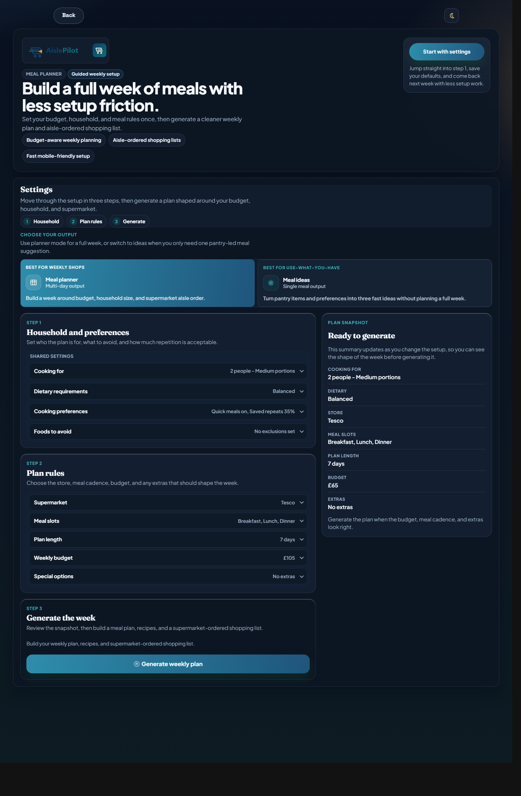
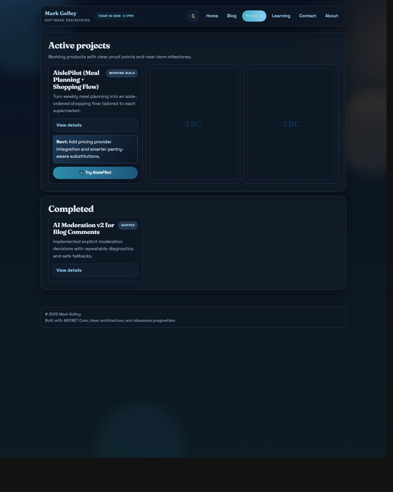

# MyBlog


ASP.NET Core application for my personal site, blog, and product experiments.

The main product build in this repo is **AislePilot**, a meal-planning and shopping workflow that turns weekly constraints into a supermarket-ordered plan, recipes, and exports.

## Screenshots

### AislePilot planner



### Projects overview



## Why This Repo Exists

This repo gives me one place to practise the kind of end-to-end software delivery I value in day-to-day engineering work:

- clear boundaries between web, domain, and test layers
- product decisions backed by automated checks
- incremental delivery instead of speculative architecture
- practical AI usage with fallbacks and guardrails

AislePilot is a side project, but the habits behind it are the same ones I try to bring to my current role: careful scoping, measured iteration, and a bias toward reliability over novelty.

## AislePilot At A Glance

AislePilot is designed around a simple question: how do you turn "what should we eat this week?" into a realistic shopping trip without making the user do all the assembly work?

Current flow:

- collect weekly constraints such as supermarket, budget, household size, meal types, dietary preferences, and exclusions
- generate a weekly meal plan with budget-aware and convenience-aware heuristics
- support pantry-led suggestions when the user wants ideas from food already on hand
- group ingredients into a shopping list ordered by supermarket aisle layout
- provide swap, ignore, save, export, and mobile shopping interactions

## Technical Snapshot

Stack:

- C# / .NET 10
- ASP.NET Core MVC + Razor views
- xUnit integration, service, and Playwright tests
- optional OpenAI-backed generation with deterministic fallback paths
- Firestore-backed caches and operational data where available

Architecture:

- `MyBlog/` contains the web app, controllers, views, startup wiring, and shared services
- `MyBlog.AislePilot/` contains AislePilot domain logic, planning, pricing/layout metadata, export logic, and AI integration seams
- `MyBlog.Tests/` contains service tests, integration tests, and browser-level checks
- `docs/agent-architecture-map.md` documents the main responsibility boundaries used during maintenance

Representative AislePilot boundaries:

- controllers shape requests and page state
- `AislePilotService.*` partials own planning, pantry, pricing, images, swap logic, and budgeting rules
- exports are isolated in `AislePilotExportService`
- tests cover logic, rendered output, and interactive behavior separately

## How I Would Scale It

If AislePilot saw sustained real-world adoption, I would scale it in stages rather than jump straight to a more complex architecture.

First steps:

- keep the web app stateless so multiple instances can sit behind standard load balancing without sticky-session requirements
- move slower or bursty work such as image generation, supermarket metadata refresh, and other enrichment tasks onto a queue-backed worker path
- persist user-specific state such as saved weeks, saved meals, and repeat preferences in durable storage rather than relying mainly on cookies
- add a shared cache for supermarket metadata, meal assets, and repeatable planning inputs so hot paths do not recompute unnecessarily

Operational scaling path:

- split latency-sensitive plan requests from background refresh jobs, with tighter timeouts and clearer retry policies for external AI/provider calls
- add request-level telemetry around generation time, cache hit rate, provider failures, and the most expensive planning branches
- keep the current service seams so pricing providers, image generation, and planning pipelines can be scaled or swapped independently
- introduce account-level quotas and stronger rate limiting before adding heavier infrastructure

In other words, I would try to preserve the current product simplicity for users while making the expensive parts asynchronous, cache-aware, and observable behind the scenes.

## Running Locally

Requirements:

- .NET SDK 10
- optional `OPENAI_API_KEY` if you want live AI-backed behavior

Run the app:

```powershell
dotnet run --project .\MyBlog
```

By default the app binds to `http://localhost:8080`.

Useful routes:

- `/`
- `/projects`
- `/projects/aisle-pilot`
- `/blog`

## Verification

Targeted AislePilot integration tests:

```powershell
dotnet test .\MyBlog.Tests\MyBlog.Tests.csproj --filter FullyQualifiedName~AislePilotIntegrationTests
```

Repo test pass:

```powershell
powershell -NoProfile -ExecutionPolicy Bypass -File .\run_checks.ps1 -Mode Tests
```

Oversized-file check:

```powershell
powershell -NoProfile -ExecutionPolicy Bypass -File .\scripts\check-oversized-files.ps1 -RepoRoot "$PWD"
```

Playwright E2E:

```powershell
powershell -NoProfile -ExecutionPolicy Bypass -File .\run_checks.ps1 -Mode E2E
```

## Tradeoffs And Current Approach

- Supermarket pricing and aisle-order insights are surfaced with provenance and review signals, but they are still curated or estimated in places rather than backed by a full live provider integration.
- AI is used where it improves flexibility, but tests run with AI generation disabled so regression coverage stays deterministic.
- The AislePilot frontend is feature-rich and well covered, but some large UI files still need a second pass for decomposition.
- The combined site hosts both portfolio/blog content and product experiments, which keeps deployment simple but means presentation decisions need to stay measured and professional.

## Next Steps

- add richer project media for AislePilot, including screenshots or a short demo capture
- continue splitting large AislePilot frontend files into smaller modules
- deepen pricing/provider integration for stronger real-world shopping estimates
- expand pantry-aware substitution and repeat-meal controls
