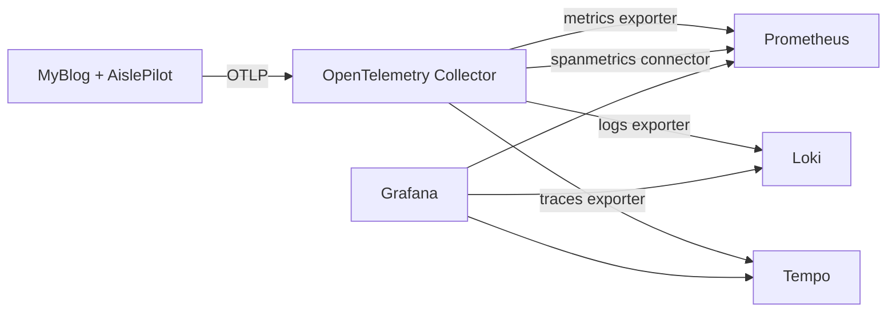

# Telemetry Architecture

## Intent

The objective is to showcase production diagnostics and operational maturity, not just telemetry output volume.  
Every signal is designed to answer:

- What happened?
- Where did it fail?
- Why did it fail?
- How expensive was it?

## Signal Design

### Traces

Primary spans:

- HTTP request pipeline (`aspnetcore` instrumentation)
- outbound provider calls (`httpclient` instrumentation + AI custom spans)
- background job execution (AislePilot image/treat/layout refresh jobs)
- authentication events

Cross-cutting span attributes include:

- `trace_id`, `request_id`, `correlation.id`
- `ai.provider`, `ai.operation`, `ai.model`
- failure metadata (`ai.error_type`, HTTP status)

### Logs

Structured JSON logs include:

- request context (`method`, `path`, `endpoint`, `status`, `latency_ms`)
- tracing context (`trace_id`, `correlation_id`, `request_id`)
- safe identity references (`user_id_hash`, `session_id_hash`)
- AI operational metadata (`operation`, `model`, `error_type`, request id when available)

### Metrics

Operational metrics:

- request rate / duration / active requests
- error rate and endpoint-level latency
- SLO and error-budget indicators (30d success, budget remaining, burn rate)
- background job success/failure and duration
- cache hit/miss
- queue depth
- user-journey funnel counts (planner view -> generation -> swap -> export)

AI metrics:

- request counts by operation/model/outcome
- duration histograms
- token usage (input/output)
- estimated cost (USD)

Business-adjacent metrics:

- comment moderation outcomes
- auth event outcomes

## Pipeline Topology

Collector responsibilities:

- receive OTLP signals
- enforce batching/memory guardrails
- enrich resource attributes
- emit derived span metrics
- route each signal to the correct backend

## Dashboard Strategy

Two dashboards are intentionally separated:

1. **Operational Overview**
   - health, latency, error trends, endpoint hotspots, failure logs
2. **AI / LLM Observability**
   - request success/failure, latency, token usage, estimated cost, queue depth

This separation helps interviewers quickly evaluate breadth (operations) and depth (AI economics + reliability).

Prometheus rule files add recording and alert rules for SLO burn-rate, latency, and background job failure conditions.
